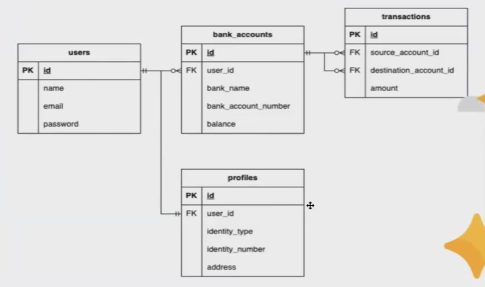

# F-BEE24001186-km7-nas-Basic-Banking-System-ExpressPrisma-ch4

###### 18 oktober 2024

<!-- PROJECT LOGO -->
<br />
<div align="center">
  <a href="https://github.com/othneildrew/Best-README-Template">
    
  </a>

  <h3 align="center">Basic-Banking-System-ExpressPrisma</h3>

</div>

* .env.development

   ```sh
   postgresql://<user>:<password>@<host>:<port>/<database_name>?schema=public
   ```

* install package

   ```sh
   npm install
   ```

* run the program

   ```sh
   npm run dev
   ```

## ERD





<!-- PROJECT LOGO -->
<br />
<div align="center">
  <a href="https://github.com/othneildrew/Best-README-Template">
    
  </a>

  <h3 align="center">Implementasi Authentifikasi dan  TTD (Testing) (CH5)</h3>

</div>

###### 29 oktober 2024

* run test

   ```sh
   npm run test
   ```

* swagger

   ```sh
   http://localhost:3000/api-docs/#/
   ```

   <!-- PROJECT LOGO -->
<br />
<div align="center">
  <a href="https://github.com/othneildrew/Best-README-Template">
    
  </a>

  <h3 align="center">Media Handling-cloud&server management-deployment gcp(aws) (CH6)</h3>

</div>

###### 8 November 2024


* swagger

   ```sh
   http://localhost:3000/api-docs/#/
   ```

* link deploymet manual (aws)

   ```sh
   http://18.139.1.255:3000/
   ```

